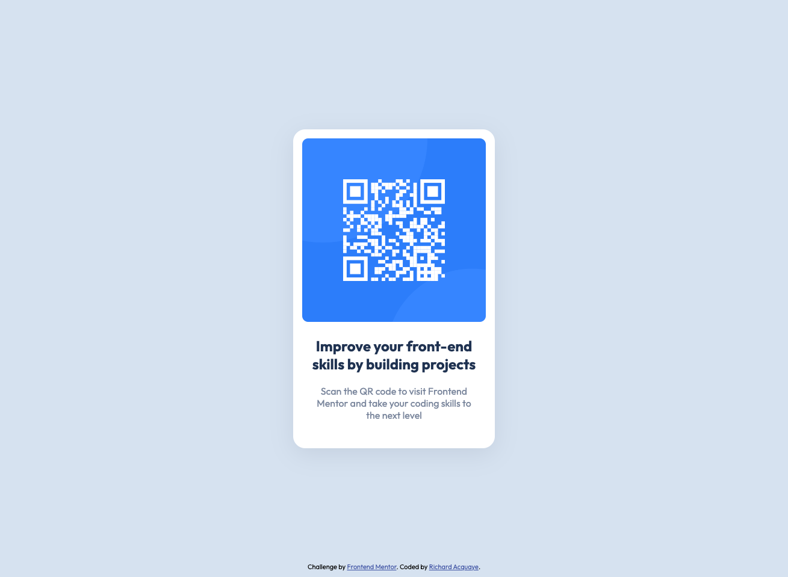

# Frontend Mentor - QR Code Component Solution

This is a solution to the [QR code component challenge on Frontend Mentor](https://www.frontendmentor.io/challenges/qr-code-component-iux_sIO_H). Frontend Mentor challenges help you improve your coding skills by building realistic projects.

## Table of contents

- [Overview](#overview)
  - [Screenshot](#screenshot)
  - [Links](#links)
- [My process](#my-process)
  - [Built with](#built-with)
  - [What I learned](#what-i-learned)
  - [Useful resources](#useful-resources)
- [Author](#author)
- [Acknowledgments](#acknowledgments)

## Overview

### Screenshot



### Links

- Solution URL: [GitHub Repo](https://github.com/Pensive1/front-end-montor-challenges/tree/main/0_qr-code-component-main)
- Live Site URL: [GitHub Page](https://pensive1.github.io/front-end-montor-challenges/0_qr-code-component-main/)

## My process

1. I started by building the component markup
1. Defined the styles in the [variables partial](https://github.com/Pensive1/front-end-montor-challenges/blob/46369d649ac65a16f1ab569aa2a40a233ee5474d/0_qr-code-component-main/styles/partials/_variables.scss)
1. Defined sass mixins to reduce repetition and lines of code
1. Applied the styles ([styles.scss](https://github.com/Pensive1/front-end-montor-challenges/blob/46369d649ac65a16f1ab569aa2a40a233ee5474d/0_qr-code-component-main/styles/styles.scss))

### Built with

- Semantic HTML5 markup
- Sass
- CSS custom properties
- Flexbox
- Mobile-first workflow

### What I learned

This challenge was a great refresher after months of job searching and JS tutorials. In this challenge I learnt how to:

#### 1. Fetch and use a Google font in Sass

To do this, I pasted the import link in the variable file then defined each font variation.

**_\_variables.scss:_**

```scss
// FONTS
@import url("https://fonts.googleapis.com/css2?family=Outfit:wght@100..900&display=swap");
$font-reg: 400;
$font-bold: 700;
```

From there, I defined the font family in the main scss file as `font-family: 'Outfit'` and that was it.

#### 2. Adding transparency to hsl values

I added a transparent grey-blue variant by adding a fourth value.

**_\_variables.scss:_**

```scss
$color-gray-blue--trans: hsl(220, 15%, 55%, 20%);
```

### Useful resources

- [developerdrive.com](https://www.developerdrive.com/how-to-easily-use-google-fonts-with-sass/) - This helped understand how to import custom fonts from Google fonts into Sass.

## Author

- Website - [Portfolio](https://www.richardacquaye.com)
- Frontend Mentor - [@Pensive1](https://www.frontendmentor.io/profile/Pensive1)

## Acknowledgments

- [Kevin Powell](https://www.youtube.com/channel/UCJZv4d5rbIKd4QHMPkcABCw) – For making me aware of the Frontend Mentor platform.

- Jessica Rodriguez ([j-rods](https://github.com/j-rods)) – For mentoring and showing me how to keep my skills sharp. She's also a former colleague who transitioned to web development in 2017.
